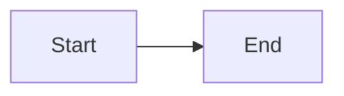

# Ramesh Srinivas - Personal Website

A Hugo-based personal website with blog support and Mermaid diagram rendering.

## Local Development

### Prerequisites
- Install Hugo: https://gohugo.io/installation/

### Run locally
```bash
cd rameshsrinivas.com
hugo server -D
```
Site will be available at http://localhost:1313

## Deploy to Netlify

### First time setup:
1. Create a GitHub repository (e.g., `rameshsrinivas.com`)
2. Push this folder to the repository:
   ```bash
   cd rameshsrinivas.com
   git init
   git add .
   git commit -m "Initial commit"
   git branch -M main
   git remote add origin git@github.com:YOUR_USERNAME/rameshsrinivas.com.git
   git push -u origin main
   ```
3. Go to https://app.netlify.com
4. Click "Add new site" → "Import an existing project"
5. Connect to GitHub and select your repository
6. Netlify will auto-detect Hugo settings from `netlify.toml`
7. Click "Deploy site"

### Custom domain setup:
1. In Netlify, go to Site settings → Domain management
2. Add custom domain: rameshsrinivas.com
3. Update your domain's DNS:
   - Option A: Point A record to Netlify's load balancer IP
   - Option B: Use Netlify DNS (they'll provide nameservers)
4. Netlify will auto-provision SSL certificate

## Adding Blog Posts

Create a new markdown file in `content/blog/`:

```markdown
---
title: "Your Post Title"
date: 2026-02-20
description: "A brief description for the listing page"
---

Your content here...

## Mermaid diagrams work:


```

Then rebuild:
```bash
hugo --gc --minify
```

Or just push to GitHub — Netlify will auto-build.

## File Structure

```
rameshsrinivas.com/
├── content/
│   ├── _index.md          # Homepage (content in template)
│   └── blog/
│       ├── _index.md      # Blog listing page
│       └── *.md           # Blog posts
├── static/
│   └── images/
│       └── headshot.png   # Your headshot
├── themes/minimal/
│   ├── layouts/           # HTML templates
│   └── static/css/        # Stylesheet
├── hugo.toml              # Site configuration
└── netlify.toml           # Netlify build settings
```

## Editing Content

- **Homepage sections**: Edit `themes/minimal/layouts/index.html`
- **Styling**: Edit `themes/minimal/static/css/style.css`
- **Site config** (title, links): Edit `hugo.toml`
- **Blog posts**: Add/edit files in `content/blog/`

## Questions?

You built this with Claude. You know where to find me.
