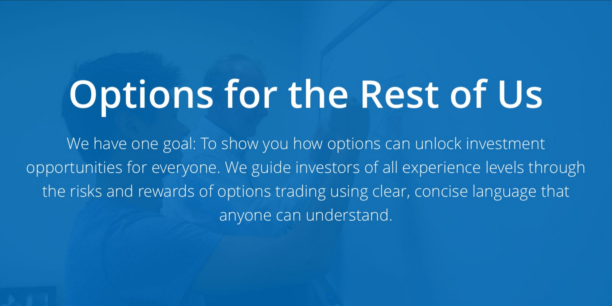

In my 22-year career as a technologist, I've had the opportunity to be part of several startups. Some didn't get off the ground. Some flattered to deceive. Others managed to get further along and become successful enough to be bought out.

Despite a less than stellar success rate in general, and the significant risks associated with startups, I've always gravitated towards them. Why, you ask?

The success rate, the risks, the ups and downs notwithstanding — you can count on coming out at the other end with precious career and life lessons. You're afforded the luxury and freedom to mold culture, to be creative, to innovate. Something that isn't exactly easy to do at conventional organizations, even if you are an intrapreneur.

Being part of the entrepreneurial team means you work with like-minded, open people who think differently, trigger inspiration, and have the zeal for creating products and services with the propensity for disruption.

It takes a certain disposition to work at a startup. An appetite for risk. A willingness to make financial sacrifices, with the hope of a payday sometime in the future. And — this is very important — the resolute support of your family. You're self-driven. You possess an all-consuming desire to make yourself and the people around you better every day.

It's been almost two years since I followed the white rabbit and embarked on a journey down the rabbit hole, taking on the role of Chief Technologist for OptionsPlay, a FinTech startup with the objective of demystifying options and making them easy "for the rest of us" to understand and trade. This right here is a winner, folks!

Here are 31 things I've learned along the way...

**1.** You wonder — at times — if perhaps you should've taken the blue pill instead of the red one.

**2.** You come real close, several times, to throwing in the towel early in the process, as you question the sanity of your decision and the people around you. "I'm done!"

**3.** You sleep on that thought, but wake up the next morning with a completely different one. "This is painful at times, but man — this is so much fun!"

**4.** You quickly realize there isn't room for perfectionism. Instead, you strive to strike just the right balance between doing things "right now" and doing them "right."

**5.** You take note of the fact that you woke up at the same time today — 3:30 AM — that you went to bed last night. Or was it morning?

**6.** Your wife goes from asking "Did you sleep well?" to "Did you sleep?" to "Whatever."

**7.** Your sleep patterns are so messed up that your fitness tracker gives up on you.

**8.** You find yourself asking "What day is it?" more often than not, because you've lost all sense of time. You have more experiences of deja vu. A glitch in the matrix.

**9.** You don't have the time or the bandwidth to fall sick or tend to a bad tooth. Health takes a back seat.

**10.** You have days when you survive on nothing more than two hours of sleep, coffee, and adrenaline.

**11.** Your lunch — when you have one — is usually food bars made of nuts, berries, granola, and dark chocolate.

**12.** You fill your playlists with music that helps achieve deep focus, creativity, power-ups, and a mental high.

**13.** Your mind is so occupied that you get into elevators, forget to hit the button, and stand there for a good few minutes before realizing you haven't moved.

**14.** You forget there's a world outside the cocoon you've created for yourself. Your social skills go from bad to barely existent.

**15.** Your friends wonder if you're alive or have turned into a complete jerk who doesn't care about them.

**16.** Your family thinks you're secretly drinking a potion that turns you into Mr. Hyde, as you snap at them for apparently no reason.

**17.** You realize you were lied to, and can actually live without social media for months.

**18.** Your hobbies are relegated to second — or even third — place, especially when deadlines start sneaking up on you.

**19.** You turn down prime-time box tickets for Roger Federer's match at the US Open "in favor" of product launch preparations. Still bummed about this.

**20.** You go "meh, whatever" when the rest of the internet loses its mind over the latest product announcement from a tech giant.

**21.** You eschew agile and scrum methodologies because they aren't fast or agile enough. Instead, you adopt the "bat out of hell, bob and weave" methodology.

**22.** You don't just wear multiple hats — you juggle them. You learn new skills and responsibilities as you make up for a smaller team.

**23.** You accomplish in a matter of hours, all by yourself, what would take an entire team days — if not months.

**24.** Your tolerance for incompetence and red tape drops as you hold yourself and everyone around you to a much higher standard.

**25.** You love the people you work with, yet get into heated debates, arguments, and shouting matches with them.

**26.** You spend an entire afternoon throwing nerf balls back and forth, even as you're discussing product features, marketing strategy, and pricing models.

**27.** You take "connected" to a whole new level — communicating over every channel imaginable, during any and all hours of the day and night.

**28.** You feel like you're slacking off when you get a message from your colleague at 1:30 in the morning, just as you sit down to catch the highlights before heading to bed.

**29.** You think of innovative ways to improve yourself, your product, process, and organization — rather than cooking up strategies to survive.

**30.** You don't have time to rest on your laurels, celebrate a win, or pat yourself on the back, because you're off on the next sprint right away.

**31.** You recognize that no one cares how cutting-edge or revolutionary your technology is, or how creative and innovative your designs are. As long as it works.

---

*Speaking of something that works — our first product, OptionsPlay Ideas, launched on September 16, 2014. The combination of professional-level analysis, trading guidance for any option on any equity, and a visual presentation simple enough for beginners yet powerful enough for experienced investors is unique in the market — and uniquely useful to anyone looking to make informed decisions on options strategies.*

