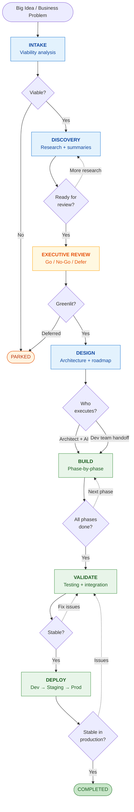
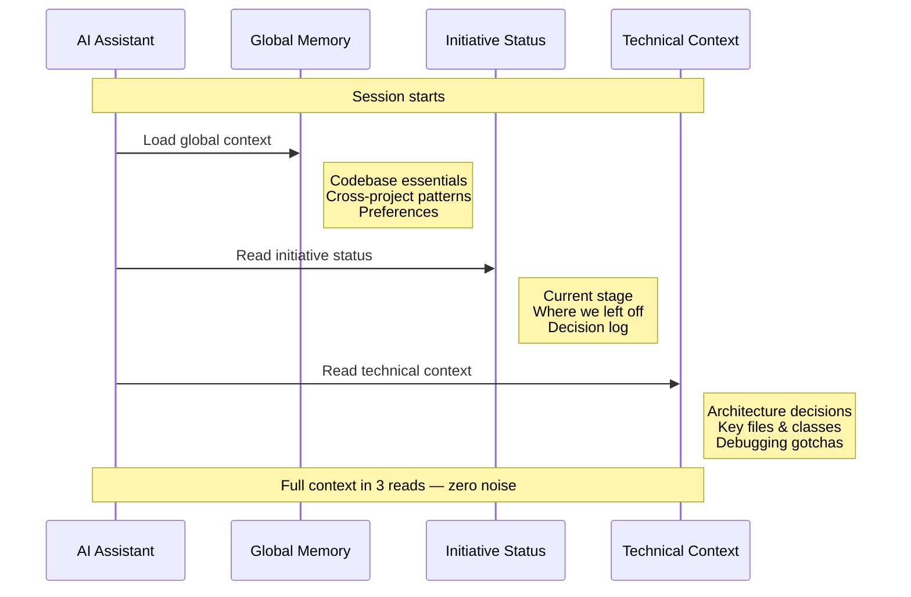

After decades of building software, I've learned that the difference between projects that ship smoothly and projects that spiral isn't _just_ talent or technology — it's process. And with AI now capable of being a genuine development partner, having the right process matters more than ever.

This is the blueprint I use at OptionsPlay to take initiatives from idea to production using AI-augmented development.

## Philosophy

**Measure twice, cut once.** The quality of the output is directly proportional to the quality of the planning. Four stages of thinking, two of building. By the time you pick up the hammer, you already know where every nail goes.

## The Lifecycle

Every initiative moves through a stage-gated pipeline. Each stage has a clear deliverable and a decision point before advancing.

**Blue** = thinking stages | **Amber** = decision gate | **Green** = building stages

---

## The Stages

### Stage 0 — Intake

**Trigger:** A big idea, a business problem, a strategic opportunity.

**Activity:** Quick viability analysis. Is this worth investing more time in? The AI excels here — it can rapidly analyze your codebase, assess feasibility, and estimate scope in a single session.

**Deliverable:** A 1-page intake assessment.

**Decision:** Viable enough to explore further? → Proceed to Discovery. Not viable? → Park it with rationale.

**Time investment:** 30-60 minutes.

### Stage 1 — Discovery

**Trigger:** Intake passed viability check.

**Activity:** Deep research into the existing system. Constraint analysis. Trade-off discussions. Stakeholder needs mapping. This is where you understand the problem deeply before proposing solutions.

The AI shines at constraint mapping and trade-off evaluation. It can hold your entire codebase in context and answer questions in seconds that would take hours of manual investigation.

**Deliverable:** Executive Summary + Technical Summary.

**Decision:** Ready for executive review? → Package and present. Need more research? → Continue Discovery.

**Time investment:** 1-3 sessions, iterative.

### Stage 2 — Executive Review

**Trigger:** Summaries are complete and polished.

**Activity:** Present to leadership team. Budget, timeline, resourcing, strategic alignment. The summaries do the talking.

**Deliverable:** Go / No-Go / Defer decision.

**Decision:** Greenlit → Proceed to Design. Deferred → Park with feedback.

**Note:** This is the one stage where AI isn't involved. Human judgment on strategic priorities.

### Stage 3 — Design

**Trigger:** Executive greenlight.

**Activity:** Architecture and design. Target architecture docs, sequence diagrams, data flow diagrams, component designs. Produce a phased, step-by-step implementation roadmap.

The key insight: **the output must be detailed enough for either you+AI or a dev team to execute against.** This forces clarity. No hand-waving. No "we'll figure it out later."

**Deliverable:** Design package + Implementation roadmap.

**Decision:** Execute with AI? → Proceed to Build. Hand off to dev team? → Package as handoff-ready.

**Time investment:** 2-5 sessions, iterative, versioned artifacts.

### Stage 4 — Build

**Trigger:** Design is locked.

**Activity:** Phase-by-phase implementation. Tests written alongside code. Progress tracked per phase. Each phase validated before advancing to the next.

This is where the [22x efficiency gain](/blog/ai-pair-programming/) happens. By the time you reach this stage, you're not figuring things out — you're executing a plan. The AI writes code that's consistent with the patterns already established in your codebase.

**Deliverable:** Working code + test results per phase.

**Decision:** Phase complete with tests passing? → Next phase. Blocked? → Diagnose, adjust, document.

### Stage 5 — Validate

**Trigger:** Code-complete (all build phases done).

**Activity:** Deploy to local dev environment. Integration testing. Runtime bug fixes. Edge case discovery. Performance validation.

The AI's debugging speed is transformative here. Root cause analysis that used to take hours takes minutes.

**Deliverable:** Validated system running locally. Bug fix documentation.

**Decision:** Stable enough for deployment? → Proceed to Deploy.

### Stage 6 — Deploy

**Trigger:** Local validation complete.

**Activity:** Deploy to shared environments. Dev → Staging → Production. Gradual rollout with feature flags. Monitoring setup. Runbook creation.

**Deliverable:** Running in production. Monitoring queries. Deployment runbooks.

**Decision:** Stable in production? → Initiative complete.

---

## The Three-Tier Memory Model

One challenge with AI-assisted development: context management. The AI doesn't remember previous sessions. You need a system.

I use a three-tier approach:

### Tier 1 — Global Memory
Cross-initiative knowledge. Codebase essentials (how to build, test, deploy). Patterns that apply everywhere. User preferences.

**Rule:** If only one initiative cares about it, it doesn't belong here.

### Tier 2 — Initiative Context
Everything specific to this initiative. Architecture decisions, technical details, integration patterns, debugging gotchas, key files and classes.

Created when an initiative enters the Build stage. Travels with the initiative through completion.

### Tier 3 — Initiative Status
Current stage, milestone history, decision log, next steps. The "where we left off" document.

Created when an initiative enters the pipeline. Updated at every milestone.

### The Session Handshake
Every new conversation starts with three reads: global memory, initiative status, technical context. Full context, zero noise from other initiatives.

---

## What AI Does Best at Each Stage

| Stage | AI's Strength |
|-------|---------------|
| **Intake** | Rapid codebase analysis, feasibility assessment, scope estimation |
| **Discovery** | Deep research, constraint mapping, trade-off evaluation, summary drafting |
| **Design** | Architecture design, diagram creation, phased roadmap generation |
| **Build** | Phase-by-phase implementation, test writing, pattern-consistent code |
| **Validate** | Fast debugging cycles, root cause analysis, edge case identification |
| **Deploy** | Monitoring queries, runbook creation, configuration management |

---

## Principles

These principles guide every initiative:

**KISS** — Keep solutions simple and focused. The AI will happily over-engineer if you let it.

**YAGNI** — Don't build for hypothetical future requirements. Solve today's problem.

**Perfection is the enemy of greatness** — Pragmatic solutions that deliver business value beat elegant solutions that never ship.

**Incremental validation** — Test each phase before moving to the next. Never carry forward broken assumptions.

**Feature flags** — Risk-free deployments, gradual rollouts. Every new behavior can be toggled off without a deployment.

**Write it down** — The act of writing crystallizes thinking. And when the AI can read those documents, every subsequent conversation starts from shared understanding.

---

## The Takeaway

The pipeline isn't bureaucracy. It's leverage.

When you have a systematic process, AI becomes a force multiplier. Without one, it's just a faster way to create chaos.

Four stages of thinking. Two stages of building. By the time you pick up the hammer, you already know where every nail goes.
