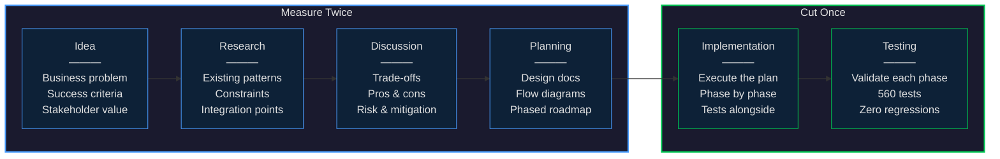

Last August, I wrote an executive summary for a major platform initiative. I spec'd it out carefully: 10 weeks to production, 2-3 developers plus QA and BA support, roughly 22 person-weeks of effort. I'd been doing this long enough to know those were honest numbers — if anything, conservative for the scope.

Six months later, I shipped it. Five working days. Just me and an AI.

Not a proof of concept. Not a prototype. A real-time rules engine evaluating thousands of securities every minute, generating ranked strategy recommendations across 11 strategy types, with an admin portal, 560 automated tests, and zero existing tests broken — integrated into a mature enterprise codebase with 100+ projects.

Here's the thing: the AI didn't make me faster at coding. It made me faster at *everything else*.

## The Process That Made It Possible

The biggest misconception about AI-assisted development is that it's about generating code quickly. It's not. The code is the easy part. What's hard — what has always been hard — is everything that comes before it.

Over the past several months, I've evolved a workflow that I now think of as a blueprint. It goes like this:

**Idea.** Start with the business problem. What are we solving? Who benefits? What does success look like? Don't touch a keyboard. Just think.

**Research.** Understand the existing system deeply. What patterns are established? What constraints exist? Where are the integration points? What has been tried before? The AI is exceptional here — it can hold an entire codebase in context and answer questions about it in seconds that would take a developer hours of spelunking.

**Discussion.** This is the part people skip, and it's the most important. Talk through the approaches. Pros and cons. Trade-offs. What are the risks? What are the failure modes? When you have an AI partner that can reason about architecture, you're not arguing with yourself in a conference room — you're having a genuine technical dialogue.

**Planning.** Formalize the approach into artifacts you can point at. I'm a visual thinker — a good sequence diagram or data flow chart is worth a thousand lines of documentation. The AI and I produced versioned design docs, flow diagrams, and a phased roadmap that went through seven revisions before we wrote a single line of production code. By the time we were done planning, I could *see* the system. Every data path, every decision point, every failure mode — mapped out before a single class was created.

**Implementation.** By the time you get here, you're not figuring things out. You're executing a plan. Each phase is a known quantity. Each step has a clear input and output. The AI writes code that's consistent with the 50 files it just read, not code that needs to be reworked to fit the codebase.

**Testing.** Not an afterthought. Tests are written alongside the implementation, validated at each phase boundary. When you have 560 tests passing, you have confidence. When you have zero existing tests broken, you have trust.

The whole flow looks like this — and yes, the irony of using a diagram to illustrate a process that advocates for diagrams is not lost on me:

The ratio matters. Four stages of thinking, two of building. That's not overhead — that's the blueprint. By the time you pick up the hammer, you already know where every nail goes.

## The Sea Change

Here's my original estimate, written before AI was part of my workflow:

- **Team:** 1 architect, 1-2 developers, QA engineer (part-time), business analyst (part-time)
- **Timeline:** 10 weeks — 2 weeks core framework, 2 weeks integration, 2 weeks UI and testing, 2 weeks UAT, 2 weeks production rollout
- **Investment:** ~22 person-weeks of effort

Here's what actually happened:

- **Team:** 1 architect (me) + 1 AI
- **Timeline:** 5 working days from first commit to running in a live environment
- **Investment:** ~1 person-week of effort

Same scope. Same quality bar. Same enterprise codebase. Same compliance and testing requirements. I didn't cut corners — I added things that weren't in the original plan: an admin portal with real-time rule editing, sorted-set-based cross-symbol rankings, after-hours strategy generation with feature-flag kill switches.

That's not a 2x improvement. That's an order of magnitude.

## What the AI Actually Did (and Didn't Do)

The AI didn't make the architectural decisions. I did. The AI didn't know that our microservices have 26 partitions that provide natural parallelism, or that our caching layer has specific serialization quirks, or that our DI container has opinions about constructor parameters. I knew those things.

What the AI did was *hold all of that in context simultaneously* and execute against it with perfect consistency. When I said "this cache layer needs to fall through from memory to Redis to MongoDB," it didn't just implement caching — it implemented caching that matched the patterns already established in a dozen other places in the codebase.

When we hit runtime bugs — and we hit several, because legacy codebases always have surprises — the debugging cycle was minutes instead of hours. One example: a ranking formula was returning zero for an entire strategy category. The AI traced the math, identified the division-by-zero edge case, found the established pattern in a different part of the codebase that already solved the same problem, and applied it. Ten minutes, including the test.

That pattern repeated over and over: find the problem, understand the root cause, locate the existing convention, apply it consistently. That's not magic. It's leverage.

## The Blueprint

If I had to distill what I've learned into advice for other senior engineers and architects:

**1. Don't skip the upfront work.** The temptation with AI is to jump straight to implementation. Resist it. The quality of your output is directly proportional to the quality of your planning. Design documents aren't bureaucracy — they're the instructions your AI pair needs to execute with precision.

**2. Treat the AI as a senior engineer, not a code generator.** Have real technical discussions. Present trade-offs and ask for analysis. When I was deciding between three storage architectures, we evaluated each against five criteria before committing. That conversation saved days of rework.

**3. Validate incrementally.** We built in phases, tested each phase before moving to the next, and never carried forward broken assumptions. By the time we reached production deployment, there were no surprises left.

**4. Know your codebase.** The AI is as good as the context you give it. I could point it at the right files, explain the non-obvious constraints, and flag the historical decisions that shaped the architecture. Domain expertise isn't replaced by AI — it's amplified by it.

**5. Write it down.** We produced design documents, architecture diagrams, and versioned roadmaps. Not because someone asked for them, but because the act of writing crystallizes thinking. And when the AI can read those documents, every subsequent conversation starts from a shared understanding.

## The Takeaway

The most interesting part wasn't the speed. It was the quality-to-speed ratio.

We didn't cut corners. We wrote comprehensive tests. We followed existing patterns. We added feature flags so every new behavior can be toggled off without a deployment. We built an admin UI so business users aren't dependent on engineering for rule changes. We produced more documentation than the original plan called for.

The future of software delivery isn't about replacing developers. It's about what happens when a senior engineer with deep domain knowledge gets a tireless, context-aware partner that can hold an entire enterprise codebase in its head. The answer: you go from 22 person-weeks to 5 days, and you ship something better than what you originally planned.

I've been building software since 1992. Thirty-four years. I still remember writing my first clock program in BASIC and thinking: *this right here — this is what I want to do.* Build things. Solve problems. Make something out of nothing.

Somewhere along the way, as systems got bigger and teams got more complex, the job shifted. Less building, more coordinating. Less solving, more estimating. The craft got buried under process.

This past week felt like 1992 again. Just me, a problem, and a tool that lets me build at the speed I can think. I'm having more fun now than I've had in years.

That's not a small thing. That's the whole point.