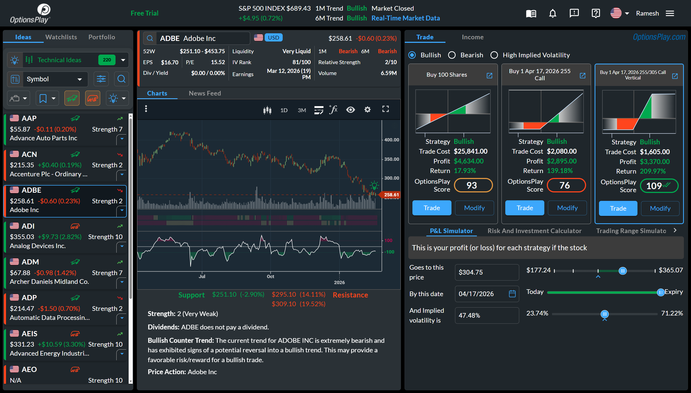

I wanted to write something profound for this milestone. After all, thirteen years at one company — a startup, no less — feels like it should come with some wisdom attached.

I searched for the right framing. The survival stats. The metrics. The milestones. Nine out of ten startups fail. Seventy percent don't make it to ten years. We're still here. We're self-funded. We're in the black. That's all true, and none of it captures what I actually want to say.

So let me try something simpler.

---

I've been doing this for thirty-four years. Technology, finance, leadership — in various combinations, at various scales. Big banks on Wall Street where I was paid well but rarely challenged, confined to a cubicle, a cog in a machine that didn't much care which cog I was. Tiny startups where the work was exhilarating but uncertainty cast a shadow over everything — every quarter, sometimes every week.

In thirty-four years, I never stayed anywhere for thirteen.

Not because the places were bad. Some were very good. But there's a difference between a good job and a place that still makes you want to show up — not out of obligation, but because you're genuinely curious about what the day might bring. After thirteen years, I'm still curious. After thirteen years, I'm still writing code. That surprises even me.

---

I [once wrote](/blog/31-things-from-startups/) about what startup life actually feels like — the sleep deprivation, the nerf balls, the heated debates. I described it as a roller coaster. Thirteen years later, it's still a roller coaster. The difference is I've stopped wanting to get off.

There's a story from the early days that I think about sometimes. My phone rang on a Sunday, and it was my boss. "Are we getting hacked?" he asked. We weren't. What had happened was a flood of new users had discovered us — all at once — and our systems were buckling under the load. It was thrilling and terrifying in equal measure.

There was also a stretch where we didn't know if we'd make payroll the following week. Not in a dramatic, movie-scene kind of way. In the quiet, stomach-churning way where you stare at a spreadsheet and the numbers simply don't add up, and you go home and don't talk about it.

We survived both. And what came out the other side is [OptionsPlay](https://www.optionsplay.com) — a platform that makes options trading accessible to everyday investors. Self-funded. Profitable. Integrated with some of the largest brokerages and financial platforms in the industry. Built by a small team that punches well above its weight.

And we're not done. Some of the most exciting work in OptionsPlay's history is happening right now — things I can't say much about yet, but the kind of work that reminds you why you got into this in the first place. After thirteen years, I'm more energized about what's ahead than what's behind.

I'm proud of what we've built. But this post isn't really about the company. It's about the people.

To my partners — the ones who've been there from day one and the ones who joined the journey along the way — thank you. We've argued. We've debated. We've driven each other crazy. And then we've shown up the next morning and done it again. That's not a business partnership. That's something closer to family.

To the people who have worked with me and for me over these thirteen years — and over the thirty-four years before that — thank you. Every engineer who stayed late to fix something that was broken. Every designer who pushed back when I was wrong. Every person who bet a stretch of their career on a company that, statistically, shouldn't have survived. You trusted us with your time, your talent, and in many cases, your families' stability. I don't take that lightly.

To the mentors — some of them former bosses — who showed me the ropes, supported me, and guided me when I didn't yet know what I didn't know — thank you. The best leaders I've encountered didn't just manage me. They invested in me. I carry that forward every day.

To the technology and business partners who use our platform, who trusted us enough to put our product in front of their customers — thank you. That kind of trust is earned slowly and lost quickly. We don't forget it.

To the collaborators, the competitors who made us sharper — thank you. Nobody builds anything alone, no matter what the mythology says.

---

And then there's my wife.

I could write an entire post about what she's made possible — and it still wouldn't be enough. She's the reason I'm not back in a cubicle somewhere, staring at a clock. When things were uncertain — and they were uncertain more often than anyone outside this company will ever know — she was the steady hand. Not because she didn't worry. She worried plenty. But she believed in what we were building, even during the stretches when I wasn't sure I did.

Every founder has a story about the person at home who absorbed the stress, carried the weight of the things left unsaid at the dinner table, and never once said *I told you so* when things went sideways. She is that person. And she did it while raising our kids, building her own life, and somehow making it all look manageable.

None of this — not a single line of code, not a single partnership, not a single year of the thirteen — would have been possible without her. That's not a figure of speech. It's a fact.

---

Thirteen years. Thirty-four in the industry. And what I've learned is this: the technology changes, the markets shift, the strategies evolve — but the people are the whole thing. Every bit of it.

Here's to the next one.
